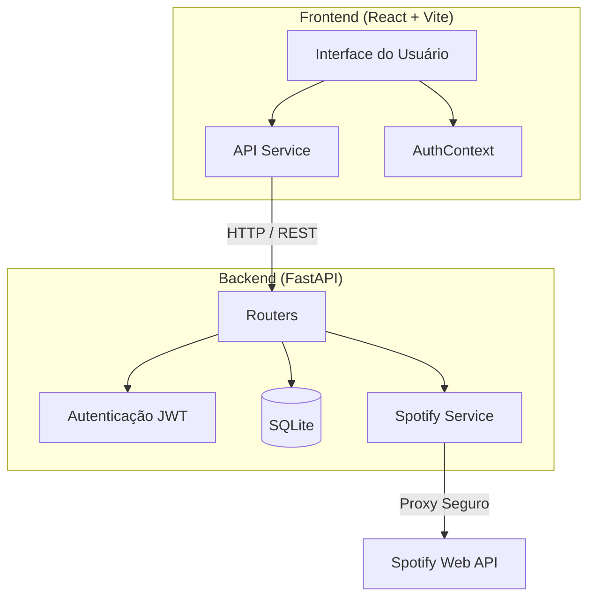

<div align="center">

  <!-- Adicione seu banner aqui -->
  <!--  -->
  
  # 🎵 Sonora

  **Sua plataforma de reviews e descoberta musical**

  [](https://react.dev/)
  [](https://fastapi.tiangolo.com/)
  [](https://www.python.org/)
  [](https://developer.spotify.com/)
  [](https://tailwindcss.com/)
  [](https://opensource.org/licenses/MIT)

</div>

---

## 🌟 Sobre o Projeto

**Sonora** é uma plataforma social de reviews de música, inspirada no Letterboxd. Permite que os usuários busquem álbuns via Spotify, escrevam avaliações detalhadas com notas de 0.5 a 5 estrelas, criem listas curadoras e acompanhem a atividade da comunidade — tudo isso com uma interface moderna, responsiva e com suporte a tema escuro e claro.

O projeto combina um frontend React com shadcn/ui e um backend FastAPI com autenticação JWT, proxy seguro para a API do Spotify e banco de dados SQLite.


## 🧩 Arquitetura




## 🚀 Funcionalidades

- **🔍 Busca por Álbuns, Artistas e Faixas** — Integração direta com a API do Spotify
- **⭐ Reviews com Meia Estrela** — Avaliações de 0.5 a 5.0 estrelas com texto em formato livre
- **📋 Listas Personalizadas** — Crie e compartilhe listas curadoras de álbuns
- **👤 Perfis Públicos** — Veja reviews e listas de outros usuários
- **📰 Feed de Atividades** — Acompanhe avaliações recentes da comunidade
- **🎨 Temas Claro e Escuro** — Interface adaptável à preferência do usuário
- **🔐 Autenticação Segura** — Login com JWT, senhas hasheadas com bcrypt
- **🌱 Seed Data Realista** — Script de seeds com 5 bots, 87 reviews e 6 listas curadoras


## 🛠️ Instalação

### Pré-requisitos

- [Node.js](https://nodejs.org/) 18+
- [Python](https://www.python.org/) 3.10+
- Credenciais da [Spotify Developer API](https://developer.spotify.com/dashboard)

### Backend

```bash
# Clone o repositório
git clone https://github.com/joaoportolan93/Sonora.git
cd Sonora

# Crie e ative o ambiente virtual
cd backend
python -m venv .venv
.venv\Scripts\activate   # Windows
# source .venv/bin/activate  # Linux/Mac

# Instale as dependências
pip install -r requirements.txt

# Configure as variáveis de ambiente
# Crie o arquivo backend/.env com:
#   SPOTIFY_CLIENT_ID=seu_client_id
#   SPOTIFY_CLIENT_SECRET=seu_client_secret
#   SECRET_KEY=sua_chave_secreta_jwt
#   DATABASE_URL=sqlite:///./sonora.db
#   FRONTEND_URL=http://localhost:5173

# (Opcional) Popule o banco com dados de exemplo
python seeds.py

# Inicie o servidor
python main.py
```

### Frontend

```bash
# Na raiz do projeto
cd ..
npm install

# Configure as variáveis de ambiente
# Crie o arquivo .env com:
#   VITE_API_URL=http://localhost:8000

# Inicie o servidor de desenvolvimento
npm run dev
```

O frontend estará disponível em `http://localhost:5173` e o backend em `http://localhost:8000`.


## 📁 Estrutura do Projeto

```
Sonora/
├── backend/
│   ├── routers/          # Rotas da API (users, lists)
│   ├── auth.py           # Autenticação JWT
│   ├── database.py       # Configuração do banco
│   ├── main.py           # App FastAPI + rotas de review/feed
│   ├── models.py         # Modelos SQLAlchemy
│   ├── schemas.py        # Schemas Pydantic
│   ├── seeds.py          # Script de dados de exemplo
│   └── spotify_service.py # Proxy para API do Spotify
├── src/
│   ├── components/       # Componentes React reutilizáveis
│   ├── contexts/         # AuthContext
│   ├── pages/            # Páginas da aplicação
│   ├── services/         # Cliente API (api.ts)
│   └── App.jsx           # Roteamento principal
├── .env                  # Variáveis do frontend
└── package.json
```


## 🔒 Segurança

- Credenciais do Spotify ficam **apenas no backend** (proxy seguro)
- Senhas são hasheadas com **bcrypt** antes de armazenar
- Autenticação via **JWT** com token de expiração
- Emails dos usuários **nunca são expostos** em endpoints públicos
- Arquivos `.env` **nunca são commitados** no Git


## 🤝 Contribuições

Contribuições são bem-vindas! Sinta-se livre para abrir issues e pull requests.


## 📄 Licença

Este projeto está sob a licença MIT — veja o arquivo [LICENSE](LICENSE) para mais detalhes.
