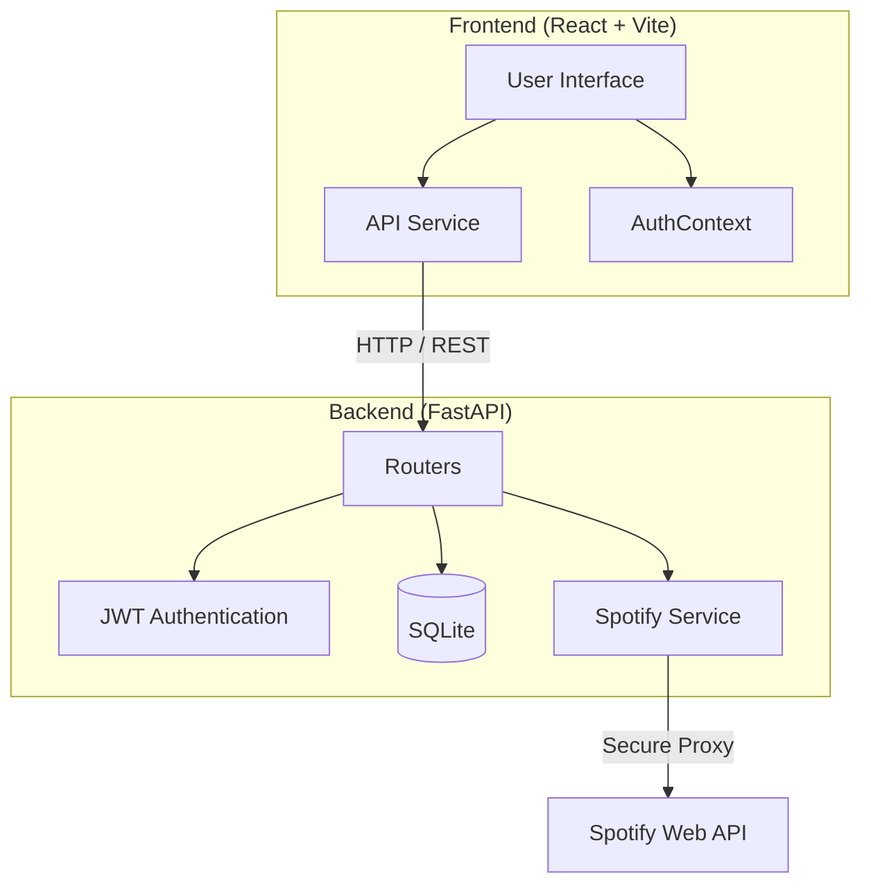

> 🇧🇷 [Leia em Português](README_pt.md)

<div align="center">

  <!-- Add your banner here -->
  <!--  -->
  
  # 🎵 Needle

  **Your platform for music reviews and discovery**

  [](https://react.dev/)
  [](https://fastapi.tiangolo.com/)
  [](https://www.python.org/)
  [](https://developer.spotify.com/)
  [](https://tailwindcss.com/)
  [](https://opensource.org/licenses/MIT)

</div>

---

## 🌟 About the Project

**Needle** is a social music review platform, inspired by Letterboxd. It allows users to search for albums via Spotify, write detailed reviews with ratings from 0.5 to 5 stars, create curated lists, and follow community activity — all with a modern, responsive interface that supports both dark and light themes.

The project combines a React frontend with shadcn/ui and a FastAPI backend featuring JWT authentication, a secure proxy for the Spotify API, and an SQLite database.


## 🧩 Architecture




## 🚀 Features

- **🔍 Search Albums, Artists, and Tracks** — Direct integration with the Spotify API
- **⭐ Half-Star Reviews** — Ratings from 0.5 to 5.0 stars with free-form text
- **📋 Custom Lists** — Create and share curated album lists
- **👤 Public Profiles** — Browse other users' reviews and lists
- **📰 Activity Feed** — Follow recent community reviews
- **🎨 Light and Dark Themes** — Interface adapts to the user's preference
- **🔐 Secure Authentication** — JWT login with bcrypt-hashed passwords
- **🌱 Realistic Seed Data** — Seed script with 5 bots, 87 reviews, and 6 curated lists


## 🛠️ Installation

### Prerequisites

- [Node.js](https://nodejs.org/) 18+
- [Python](https://www.python.org/) 3.10+
- [Spotify Developer API](https://developer.spotify.com/dashboard) credentials

### Backend

```bash
# Clone the repository
git clone https://github.com/joaoportolan93/Needle.git
cd Needle

# Create and activate the virtual environment
cd backend
python -m venv .venv
.venv\Scripts\activate   # Windows
# source .venv/bin/activate  # Linux/Mac

# Install dependencies
pip install -r requirements.txt

# Set up environment variables
# Create the backend/.env file with:
#   SPOTIFY_CLIENT_ID=your_client_id
#   SPOTIFY_CLIENT_SECRET=your_client_secret
#   SECRET_KEY=your_jwt_secret_key
#   DATABASE_URL=sqlite:///./needle.db
#   FRONTEND_URL=http://localhost:5173

# (Optional) Populate the database with sample data
python seeds.py

# Start the server
python main.py
```

### Frontend

```bash
# From the project root
cd ..
npm install

# Set up environment variables
# Create the .env file with:
#   VITE_API_URL=http://localhost:8000

# Start the development server
npm run dev
```

The frontend will be available at `http://localhost:5173` and the backend at `http://localhost:8000`.


## 📁 Project Structure

```
Needle/
├── backend/
│   ├── routers/          # API routes (users, lists)
│   ├── auth.py           # JWT authentication
│   ├── database.py       # Database configuration
│   ├── main.py           # FastAPI app + review/feed routes
│   ├── models.py         # SQLAlchemy models
│   ├── schemas.py        # Pydantic schemas
│   ├── seeds.py          # Sample data script
│   └── spotify_service.py # Spotify API proxy
├── src/
│   ├── components/       # Reusable React components
│   ├── contexts/         # AuthContext
│   ├── pages/            # Application pages
│   ├── services/         # API client (api.ts)
│   └── App.jsx           # Main routing
├── .env                  # Frontend environment variables
└── package.json
```


## 🔒 Security

- Spotify credentials are stored **only in the backend** (secure proxy)
- Passwords are hashed with **bcrypt** before storage
- Authentication via **JWT** with token expiration
- User emails are **never exposed** in public endpoints
- `.env` files are **never committed** to Git


## 🤝 Contributing

Contributions are welcome! Feel free to open issues and pull requests.


## 📄 License

This project is licensed under the MIT License — see the [LICENSE](LICENSE) file for details.
